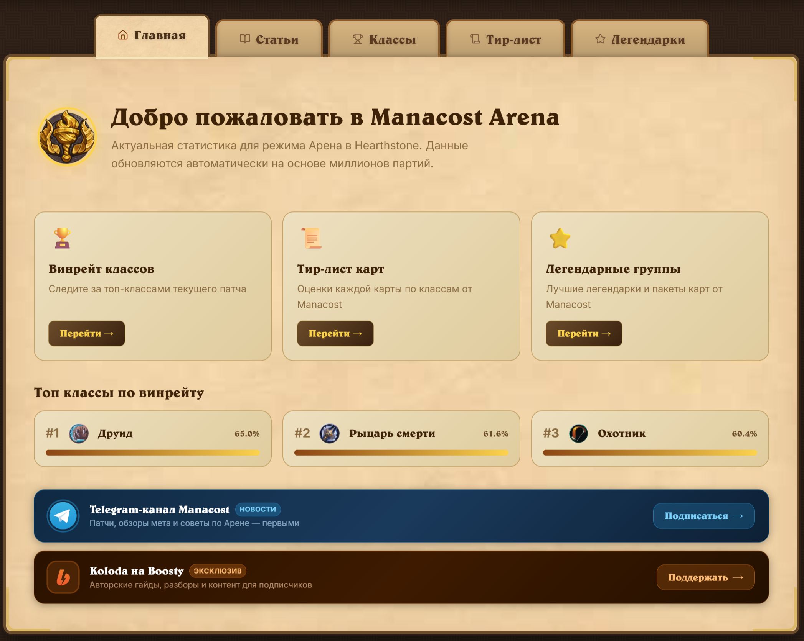
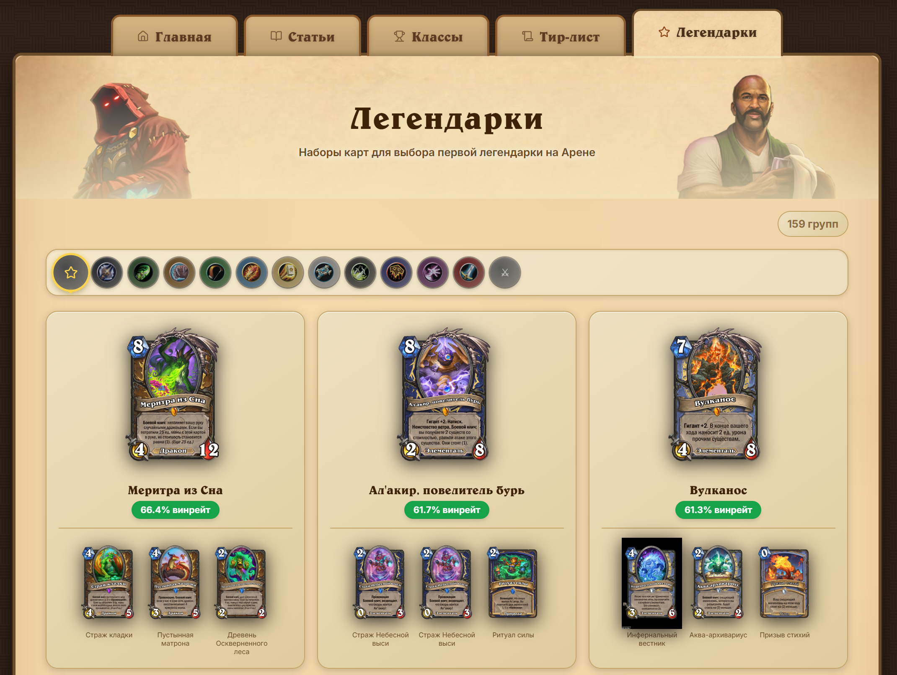

<div align="center">

# ⚔️ Manacost Arena

**Статистика Hearthstone Арены на русском языке**

[](https://vercel.com)
[](https://react.dev)
[](https://www.typescriptlang.org)
[](https://vitejs.dev)
[](https://tailwindcss.com)
[](LICENSE)

*Актуальный тир-лист карт, винрейты классов и группы легендарок — всё в одном месте.*

</div>

---

## 📸 Скриншоты

<table>
  <tr>
    <td align="center" width="33%">
      
      <br/><sub><b>🏠 Главная</b></sub>
    </td>
    <td align="center" width="33%">
      
      <br/><sub><b>📜 Тир-лист карт</b></sub>
    </td>
    <td align="center" width="33%">
      
      <br/><sub><b>⭐ Легендарки</b></sub>
    </td>
  </tr>
</table>

---

## ✨ Возможности

- 🏆 **Тир-лист карт** — S/A/B/C/D/E/F по каждому классу и нейтральным картам, данные HearthArena
- 📊 **Винрейты классов** — актуальная статистика побед из Firestone / zerotoheroes.com
- 🌟 **Группы легендарок** — тематические группы легендарных карт с процентом побед
- 📰 **Статьи** — раздел новостей и гайдов по Арене, управляемый через админ-панель
- 🖼️ **Изображения карт** — двойной источник (HearthArena CDN + Blizzard API на русском)
- 🔍 **Поиск по картам** — мгновенная фильтрация по названию внутри тир-листа
- 🎯 **Модальное окно карты** — полноэкранный просмотр с манакостом, редкостью и тиром
- 📱 **Адаптивный дизайн** — корректное отображение на мобильных устройствах и десктопе
- 🌙 **Тёмная тема** — атмосферный дизайн в стиле Hearthstone с текстурными фонами
- 🔐 **Админ-панель** — добавление/удаление статей, доступ ограничен по IP + паролю
- ⚡ **Vercel Analytics + Speed Insights** — встроенная аналитика производительности
- 🤖 **AI-интеграция** — `@google/genai` (Gemini) готов к использованию

---

## 🛠️ Технологический стек

### Frontend

| Технология | Версия | Назначение |
|---|---|---|
| React | 19 | UI-фреймворк |
| TypeScript | 5.8 | Типизация |
| Vite | 6 | Сборщик и dev-сервер |
| Tailwind CSS | 4 | Утилитарные стили |
| Lucide React | 0.546 | Иконки |
| Vercel Analytics | 2.0 | Веб-аналитика |
| Vercel Speed Insights | 2.0 | Метрики производительности |

### Backend / API

| Технология | Версия | Назначение |
|---|---|---|
| Express.js | 4 | Локальный API-сервер (dev) |
| Vercel Serverless Functions | — | Production API |
| Vercel Blob Store | — | Хранение статей |
| Puppeteer | 22 | Парсинг HearthArena |
| node-cron | 3 | Расписание парсинга (каждые 6 ч.) |
| compression | 1.8 | Gzip-сжатие ответов |
| dotenv | 17 | Переменные окружения |
| tsx | 4 | Запуск TypeScript без компиляции |
| Google Generative AI | 1.29 | Gemini AI (интегрирован, готов к использованию) |

---

## 🏗️ Архитектура

```
┌─────────────────────────────────────────────────────────────────┐
│                        BROWSER (React SPA)                      │
│                                                                 │
│   ┌──────────┐  ┌──────────┐  ┌────────────┐  ┌────────────┐  │
│   │ Winrates │  │ Tierlist │  │Legendaries │  │  Articles  │  │
│   └────┬─────┘  └────┬─────┘  └─────┬──────┘  └─────┬──────┘  │
│        └─────────────┴──────────────┴────────────────┘         │
│                            │ fetch /api/*                       │
└────────────────────────────┼────────────────────────────────────┘
                             │
          ┌──────────────────┴──────────────────┐
          │                                     │
   [PRODUCTION]                           [DEVELOPMENT]
   Vercel Serverless Functions             Express.js :3001
          │                                     │
   ┌──────┴─────────────────────────┐    ┌──────┴──────────────────┐
   │ api/winrates.js  → zerotoheroes│    │ /api/winrates           │
   │ api/tierlist.js  → static JSON │    │ /api/tierlist           │
   │ api/legendaries.js → static    │    │ /api/legendaries        │
   │ api/articles.js  → Blob Store  │    │ /api/articles           │
   │ api/admin-articles (IP + pwd)  │    │ /api/admin-articles     │
   │ api/check-ip.js                │    │ /api/check-ip           │
   │ api/scrape.js    → 501 stub    │    │ /api/scrape (+ cron)    │
   └────────────────────────────────┘    └────────────┬────────────┘
                                                      │
                                           ┌──────────┴──────────┐
                                           │  Puppeteer Scraper  │
                                           │  hearth-arena.com   │
                                           │  + Blizzard API     │
                                           └─────────────────────┘
```

### Модель данных

```
server/data/
  ├── winrates.json     — классы + % побед (обновляется из zerotoheroes.com)
  ├── tierlist.json     — тиры S-F со всеми картами + CardLookup (изображения, статы)
  ├── legendaries.json  — группы легендарок + winrate
  ├── articles.json     — статьи (dev fallback; в prod — Vercel Blob Store)
  └── cards_ru.json     — авторитетная БД карт (редкость, тип, ID)
```

---

## 📁 Структура проекта

```
manacost-arena/
├── api/                        # Vercel Serverless Functions (production)
│   ├── winrates.js             # GET — статистика классов (live из zerotoheroes.com)
│   ├── tierlist.js             # GET — тир-лист карт (из server/data)
│   ├── legendaries.js          # GET — группы легендарок (из server/data)
│   ├── articles.js             # GET — список статей (Blob Store / local)
│   ├── admin-articles.js       # POST/DELETE — управление статьями (IP + пароль)
│   ├── check-ip.js             # GET — проверка IP-доступа для фронтенда
│   ├── scrape.js               # 501 stub — scraping в serverless недоступен
│   └── status.js               # GET — статус и время обновления данных
│
├── server/                     # Локальный dev-сервер
│   ├── index.ts                # Express.js сервер + cron-расписание (6 ч.)
│   ├── scraper.ts              # Puppeteer парсер HearthArena + Blizzard API
│   ├── data/                   # Scraped JSON-файлы (коммитятся в репо)
│   └── debug_ha*.ts            # Вспомогательные дебаг-скрипты парсера
│
├── src/                        # React frontend
│   ├── App.tsx                 # Приложение (все секции, компоненты, хуки)
│   ├── main.tsx                # Точка входа React + Analytics
│   └── index.css               # Глобальные стили (Tailwind + кастомные)
│
├── public/                     # Статические ресурсы
│   ├── assets/                 # Иконки маны, редкости, арены
│   ├── class_icon/             # Иконки классов Hearthstone (11 классов)
│   ├── fonts/                  # Шрифты (Hearthstone-стиль)
│   └── wallpaper/              # Текстурные фоны секций
│
├── vercel.json                 # Конфигурация Vercel (rewrite rules, skip Puppeteer DL)
├── vite.config.ts              # Конфигурация Vite
├── tsconfig.json               # Настройки TypeScript
└── package.json
```

---

## 🚀 Локальная разработка

### Требования

- Node.js **22+**
- npm **10+**
- Google Chrome / Chromium (для Puppeteer-парсера)

### 1. Клонирование и установка

```bash
git clone https://github.com/YOUR_USERNAME/manacost-arena.git
cd manacost-arena
npm install
```

### 2. Переменные окружения

Создайте файл `.env` в корне проекта:

```env
# Blizzard Battle.net API (для изображений карт на русском)
BLIZZARD_CLIENT_ID=your_client_id
BLIZZARD_CLIENT_SECRET=your_client_secret

# Vercel Blob Store (для статей в production)
BLOB_READ_WRITE_TOKEN=vercel_blob_rw_...

# Пароль для админ-панели
ADMIN_PASSWORD=your_secure_password
```

> **Минимальный запуск:** Без переменных окружения сайт работает с fallback-данными
> из `server/data/`. Для обновления тир-листа нужны `BLIZZARD_CLIENT_ID` + `BLIZZARD_CLIENT_SECRET`.

### 3. Первоначальный парсинг данных

```bash
# Запустить парсер — сохранит данные в server/data/
npm run scrape
```

### 4. Запуск в режиме разработки

```bash
# Запустить frontend (Vite :3000) + backend (Express :3001) одновременно
npm run dev

# Или по отдельности:
npm run dev:frontend   # Только Vite
npm run dev:server     # Только Express + cron
```

Приложение будет доступно по адресу: **http://localhost:3000**

### 5. Сборка для production

```bash
npm run build      # Собрать в dist/
npm run preview    # Предпросмотр собранного бандла
npm run lint       # Проверка типов TypeScript
```

---

## 🔌 API-эндпоинты

Все эндпоинты возвращают JSON. В production — Vercel Serverless Functions, в dev — Express.js на порту `3001`.

| Метод | URL | Описание | Кеш |
|---|---|---|---|
| `GET` | `/api/winrates` | Винрейты всех классов (live) | 1 час (CDN) |
| `GET` | `/api/tierlist` | Полный тир-лист всех карт | 24 часа (CDN) |
| `GET` | `/api/legendaries` | Группы легендарных карт | 24 часа (CDN) |
| `GET` | `/api/articles` | Список статей | no-store |
| `GET` | `/api/status` | Время последнего обновления данных | — |
| `GET` | `/api/check-ip` | Проверка, входит ли IP в whitelist | — |
| `POST` | `/api/admin-articles` | Добавить статью *(IP + пароль)* | — |
| `DELETE` | `/api/admin-articles` | Удалить статью по ID *(IP + пароль)* | — |
| `POST` | `/api/scrape` | Запустить парсинг вручную *(только dev)* | — |

### Примеры запросов

```bash
# Получить винрейты
curl https://your-domain.vercel.app/api/winrates

# Добавить статью (только с разрешённого IP)
curl -X POST https://your-domain.vercel.app/api/admin-articles \
  -H "Content-Type: application/json" \
  -d '{
    "password": "your_password",
    "article": {
      "title": "Гайд по Рыцарю смерти",
      "excerpt": "Почему ДК — лучший класс на Арене...",
      "tag": "гайд",
      "url": "https://example.com/guide"
    }
  }'

# Удалить статью
curl -X DELETE https://your-domain.vercel.app/api/admin-articles \
  -H "Content-Type: application/json" \
  -d '{"password": "your_password", "id": "1703123456789"}'
```

---

## 🔐 Безопасность

Админ-панель (`?admin`) защищена двумя уровнями:

1. **IP-вайтлист** — запросы к `/api/admin-articles` принимаются только с разрешённых IP-адресов
2. **Пароль** — все мутирующие операции требуют поле `password` в теле запроса

Список разрешённых IP задаётся в `api/admin-articles.js` и `api/check-ip.js`.

---

## ☁️ Деплой на Vercel

### Автоматический деплой

1. Сделайте fork репозитория
2. Подключите репозиторий в [Vercel Dashboard](https://vercel.com/new)
3. Vercel автоматически определит Vite-проект через `vercel.json`
4. Задайте переменные окружения в настройках проекта

### Переменные окружения на Vercel

Перейдите: **Settings → Environment Variables**

| Переменная | Обязательность | Описание |
|---|---|---|
| `BLOB_READ_WRITE_TOKEN` | Обязательна | Токен Vercel Blob Store для статей |
| `ADMIN_PASSWORD` | Рекомендуется | Пароль для доступа к админ-панели |
| `BLIZZARD_CLIENT_ID` | Опционально | Для русских изображений карт |
| `BLIZZARD_CLIENT_SECRET` | Опционально | Для русских изображений карт |

### Обновление тир-листа

Тир-лист хранится как статический JSON (Puppeteer не работает в serverless-среде):

```bash
npm run scrape              # Обновить server/data/*.json
git add server/data/
git commit -m "Data: update tierlist + legendaries"
git push                    # Vercel автоматически передеплоит
```

Винрейты (`/api/winrates`) получаются в реальном времени из zerotoheroes.com — ручного обновления не требуют.

---

## 🗺️ Источники данных

| Данные | Источник | Метод получения |
|---|---|---|
| Тир-лист карт | [hearth-arena.com](https://www.hearth-arena.com) | Puppeteer (парсинг DOM) |
| Винрейты классов | [zerotoheroes.com](https://www.zerotoheroes.com) / Firestone | REST API (live) |
| Группы легендарок | hearth-arena.com | Puppeteer |
| Изображения карт (приоритет) | Blizzard Battle.net API | OAuth2 + REST |
| Изображения карт (fallback) | HearthArena CDN | Прямые URL |
| Изображения карт (fallback 2) | hearthstonejson.com | CDN |

---

## 📜 Лицензия

Copyright © 2024–2026 Manacost Arena

Распространяется под лицензией [Apache 2.0](LICENSE).

Данные о картах и изображения являются собственностью Blizzard Entertainment.
Статистика предоставляется сторонними сервисами (HearthArena, Firestone / zerotoheroes.com).
Этот проект не является официальным продуктом Blizzard.

---

<div align="center">

Сделано с ❤️ для русскоязычного сообщества Hearthstone Арены

</div>
